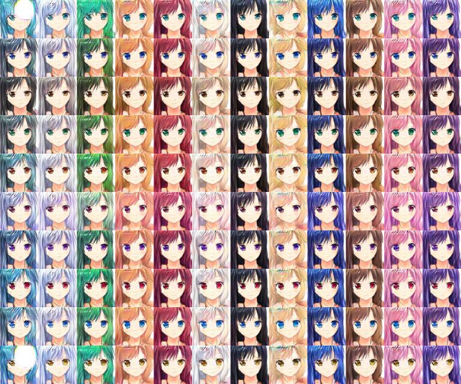
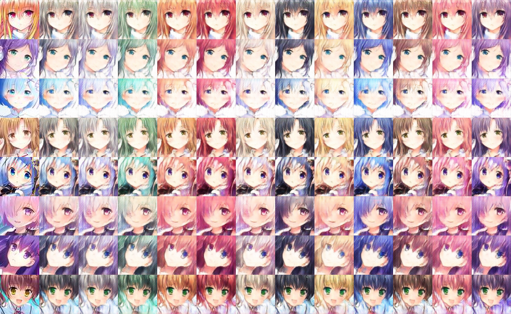

# anime-girls-generation-GAN

> DCGAN, WGAN-GP, ACGAN, CycleGAN

Implementation of GANs for different purposes.  

* DCGAN: randomly generate cute anime girls.
* WGAN-GP: randomly generate cute anime girls.
* ACGAN: randomly generate cute anime girls with specific hair and eyes color.
* CycleGAN: change hair color (style transfer).

## Results
* ACGAN

    

* CycleGAN

    

* DCGAN & WGAN-GP

    
    

## Training progress
* GAN  

    

* ACGAN  

    

* CycleGAN  

    

## Usage
code will release after Jun 8 2018

## Dataset
30k from [MakeGirlsMoe](https://make.girls.moe)  
10k from [Konachan](http://konachan.net/)  
each picture has one hair color tag and one eyes color tag.  

preprocessing: 
* keep one face in one picture and crop out other things.
* resize to 64\*64, which means the model should input with 64\*64 and have the same size outputs.

## Reference